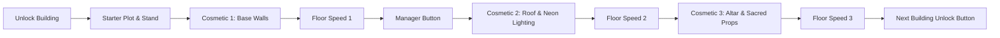

# Cult Tycoon: Building Upgrades & Construction Catalog

This document specifies the **8 Core Functional Speed Upgrades** and **Intermediary Structural/Cosmetic Upgrades** for all 10 buildings in *Raise a Cult*. 

Each building follows a natural physical build-up sequence (Foundation $\rightarrow$ Enclosure $\rightarrow$ Sacred Props $\rightarrow$ Technology $\rightarrow$ Overdrive), using simple geometric Roblox parts (blocks, wedges, cylinders, point lights) that are straightforward to assemble and animate with pop-in slide transitions.

---

## 🏗️ The Tycoon Construction & Gating Formula

Every building follows a standardized purchase progression so players watch their cult visually evolve before moving to the next tier:

-## 🏛️ Building 1: Street Corner Preacher
* **Theme:** Humble sidewalk evangelism on a cardboard & folding table setup.
* **Unlock Cost:** **$0** (Free Starter) | **Base Unit:** **$15** | **Manager:** **$250**

### 1. Construction & Upgrade Sequence
| Step | Type | Name | Cost | 3D Visual Asset (Easy Build) | Gameplay Effect |
| :--- | :--- | :--- | :--- | :--- | :--- |
| **0** | **Base** | Folding Table & Member | **$0** | Brown plastic folding table, 1 Cultist NPC | Active Click / Collect GUI |
| **—** | **Manager**| Corner Manager | **$250** | 1 Cultist NPC standing behind collection stand | Automated Collection |
| **1** | **Speed 1**| Worship Flyers | **$50** | 3 white paper flyers on table with leader face | **$2\times$ Speed** ($0.5\text{s}$) |
| **2** | **Speed 2**| More Preachers | **$500** | 2 additional chanting NPCs beside the table | **$2\times$ Speed** ($0.25\text{s}$) |
| **3** | **Cosmetic**| Pop-Up Canopy Tents | **$1,500** | 3 thin metallic poles with pyramid canopy roofs | Shelter structure visual |
| **4** | **Speed 3**| Street Megaphones | **$8,500** | 2 grey megaphone horns mounted on poles | **$2\times$ Speed** ($0.125\text{s}$) |
| **5** | **Cosmetic**| Sidewalk Chalk Circle | **$15,000** | Chalk circle drawing on floor + chalk cartons | Sacred boundary visual |
| **6** | **Gate** | *Unlocks Building 2 Button ($30k)* | — | Floor button to Storage Unit plot | Progression Unlocked |
| **7** | **Speed 4**| Outreach Info Booth | **$525,000** | Second wooden booth with pamphlet racks & phone| **$2\times$ Speed** ($0.0625\text{s}$) |
| **8** | **Speed 5**| Printed Booklets | **$6.0\text{M}$** | Book stacks, open boxes & distributor member | **$2\times$ Speed** ($0.03125\text{s}$) |
| **9** | **Speed 6**| PA Speaker Towers | **$375\text{M}$** | 2 tall black truss towers with audio speakers | **$2\times$ Speed** ($0.0156\text{s}$) |
| **10**| **Speed 7**| LED Street Signs | **$112.5\text{B}$** | Neon glowing billboard sign | **$2\times$ Speed** ($0.0078\text{s}$) |
| **11**| **Speed 8**| Holy Podium Statue | **$2.25\text{Qa}$** | Elevated marble podium with giant player statue | **$3\times$ Speed** ($0.0026\text{s}$) |

---

## 🏛️ Building 2: Storage Unit Temple
* **Theme:** Converted underground self-storage unit turned makeshift congregation.
* **Unlock Cost:** **$30,000** ($30K) | **Base Prod:** **$3,600** ($1,200/s) | **Manager:** **$500,000** ($500K)

### 1. Construction & Upgrade Sequence
| Step | Type | Name | Cost | 3D Visual Asset (Easy Build) | Gameplay Effect |
| :--- | :--- | :--- | :--- | :--- | :--- |
| **0** | **Base** | Roll-Up Metal Door Frame | **$30,000** | Corrugated metal walls, open roll-up shutter door | Spawns Building 2 base |
| **1** | **Cosmetic** | Concrete Flooring & Rug | **$45,000** | Grey concrete floor with a long velvet red carpet | Flooring visual |
| **2** | **Speed 1** | Folding Chairs (Pews) | **$60,000** | 2 rows of metal folding chairs with seated cultists | **$2\times$ Speed** ($1.5\text{s}$) |
| **—** | **Manager** | Storage Unit Caretaker | **$500,000** | NPC with clipboard and keys standing by entrance | Automated Collection |
| **3** | **Cosmetic** | Fluorescent Tube Lights / Mic| **$125,000** | Overhead lighting and altar microphone | Ambient/audio visual |
| **4** | **Speed 2** | Audio Cassette Sermons | **$250,000** | Vintage boombox on crate with cassette tapes | **$2\times$ Speed** ($0.75\text{s}$) |
| **5** | **Cosmetic** | Cinderblock Altar | **$750,000** | Stacked cinderblocks covered in black cloth & candles | Altar visual |
| **6** | **Speed 3** | Vending Donation Machine | **$5.0\text{M}$** | Retro soda vending machine retrofitted for tithing | **$2\times$ Speed** ($0.375\text{s}$) |
| **—** | **Gate** | *Unlocks Building 3 Button ($15M)* | — | Floor button to Suburban Compound | Progression Unlocked |
| **7** | **Speed 4** | Soundproofing Foam / Posters| **$75.0\text{M}$** | 3D avatar pose posters and acoustic wall foam | **$2\times$ Speed** ($0.187\text{s}$) |
| **8** | **Speed 5** | Heavy Metal Rolling Shutter | **$500.0\text{M}$** | Reinforced motorized garage door with proximity sensor | **$2\times$ Speed** ($0.093\text{s}$) |
| **9** | **Speed 6** | Industrial HVAC System | **$2.5\text{B}$** | Silver ventilation ducting running along ceiling | **$2\times$ Speed** ($0.046\text{s}$) |
| **10**| **Speed 7** | Closed-Circuit Security | **$7.5\text{B}$** | 4 security cameras with blinking red LED dots | **$2\times$ Speed** ($0.023\text{s}$) |
| **11**| **Speed 8** | Golden Storage Vault | **$250.0\text{B}$** | Heavy bank vault door embedded into back wall | **$3\times$ Speed** ($0.0078\text{s}$) |

---

## 🏛️ Building 3: Suburban Compound
* **Theme:** Gated two-story suburban house with manicured grounds and compound fortifications.
* **Unlock Cost:** **$15,000,000** ($15M) | **Base Prod:** **$1,500,000** ($250,000/s) | **Manager:** **$150.0M**

### 1. Construction & Upgrade Sequence
| Step | Type | Folder / Upgrade Name | Cost | 3D Visual Asset (Option B: Ground-Up) | Gameplay Effect |
| :--- | :--- | :--- | :--- | :--- | :--- |
| **0** | **Base** | `00_Starter_Overseer_Station` | **$15\text{M}$** | Welcome desk, Cultist NPC, and `CollectUpgradeGui` on front lawn | Spawns Building 3; active click/collect hub |
| **—** | **Manager** | Compound Overseer | **$150\text{M}$** | Robed elder NPC holding ledger book standing at welcome desk | Automated Collection |
| **1** | **Cosmetic** | `01_Foundation_and_Framing` | **$20\text{M}$** | Concrete foundation slabs, footings, and crawlspace framing | Foundation footprint appears |
| **2** | **Cosmetic** | `02_Exterior_Walls_and_Windows` | **$30\text{M}$** | Red brick perimeter walls, siding, exterior doors, windows with shutters & blinds | House envelope is fully standing |
| **3** | **Cosmetic** | `03_Roof_and_Chimney` | **$45\text{M}$** | Main roof gables, shingles, porch overhangs, garage roof, and brick chimney stack | House is fully sheltered & roofed |
| **4** | **Speed 1** | Communal Kitchen Setup | **$70\text{M}$** | First cooking station & food pantry in the house | **$2\times$ Speed** ($3.0\text{s}$) |
| **5** | **Cosmetic** | `04_Front_Porch` | **$120\text{M}$** | Wooden porch deck, front steps, white railings/balusters, and support pillars | Welcoming entrance visual |
| **6** | **Cosmetic** | `05_Driveway_and_Garden` | **$200\text{M}$** | Concrete driveway, cobblestone paths, green lawn, garden trees, flower beds | Complete exterior landscaping |
| **7** | **Cosmetic** | `06_Staircase_and_Hallways` | **$350\text{M}$** | 18 floating wooden steps, landing platform, 2 support pillars, balusters, red circular rug | Connects 1st and 2nd floors |
| **8** | **Cosmetic** | `07_LivingRoom_Lounge` | **$600\text{M}$** | White sectional sofa, pillows, wood coffee table, end table, white lamp, ceiling fan | Ground floor lounge visual |
| **9** | **Speed 2** | Bunk Bed Barracks | **$1.0\text{B}$** | 2 wooden bunk beds with resting recruits | **$2\times$ Speed** ($1.5\text{s}$) |
| **10** | **Cosmetic** | `08_LivingRoom_Entertainment` | **$1.8\text{B}$** | Freestanding slate room divider, glass flame hearth, wall-mounted flat-screen TV | Modern living centerpiece visual |
| **11** | **Cosmetic** | `09_Dining_Room` | **$3.0\text{B}$** | Light-green oval rug, oval dining table, 6 chairs, 6 dinner plates, fruit bowl, chandelier | Communal dining area visual |
| **12** | **Speed 3** | Ham Radio Antenna | **$5.0\text{B}$** | Roof-mounted shortwave broadcast antenna tower | **$2\times$ Speed** ($0.75\text{s}$) |
| **—** | **Gate** | *Unlocks Building 4 Button ($10B)* | — | Floor button to Community Hall plot | Progression Unlocked |
| **13** | **Cosmetic** | `13_Bathroom` | **$8.0\text{B}$** | Marble tile flooring, bathtub enclosure, porcelain toilet, vanity counter, sink, mirror | Restroom visual |
| **14** | **Cosmetic** | `12_Guest_Bedrooms` | **$15.0\text{B}$** | Guest beds, study desks, chairs, wardrobe closets, bedroom carpets | Member quarters visual |
| **15** | **Cosmetic** | `11_Master_Bedroom` | **$25.0\text{B}$** | Master bed (headboard, duvet, pillows), plush carpet, nightstands, table lamps, dresser | Cult Leader suite visual |
| **16** | **Cosmetic** | `14_Garage_and_Car` | **$40.0\text{B}$** | Garage concrete floor, roll-up door slats, tool workbenches, shelves, and Cult Car | Full garage & getaway car visual |
| **17** | **Speed 4** | Garden Crop Plots | **$75.0\text{B}$** | 3 raised vegetable farm beds behind the house | **$2\times$ Speed** ($0.375\text{s}$) |
| **18** | **Speed 5** | Solar Panel Array | **$250.0\text{B}$** | 6 angled photovoltaic solar panels on the roof | **$2\times$ Speed** ($0.187\text{s}$) |
| **19** | **Speed 6** | Watchtower Lookout | **$1.5\text{T}$** | Elevated wooden guard tower with functional spotlight | **$2\times$ Speed** ($0.093\text{s}$) |
| **20** | **Speed 7** | Secret Bunker Hatch | **$10.0\text{T}$** | Heavy steel blast door hatch embedded into lawn | **$2\times$ Speed** ($0.046\text{s}$) |
| **21** | **Speed 8** | Blessed Compound Gates | **$100.0\text{T}$** | Heavy wrought-iron compound security gates | **$3\times$ Speed** ($0.0156\text{s}$) |

---

## 🏛️ Building 4: Community Hall
* **Theme:** Suburban civic center converted into a high-capacity indoctrination theatre.
* **Unlock Cost:** **$10,000,000,000** ($10B) | **Base Prod:** **$800,000,000** ($800M) | **Base Cycle Time:** **10.0s** ($80M/s) | **Manager:** **$100.0B**

### 1. Construction & Upgrade Sequence
| Step | Type | Name | Cost | 3D Visual Asset (Easy Build) | Gameplay Effect |
| :--- | :--- | :--- | :--- | :--- | :--- |
| **0** | **Base** | Auditorium Floor & Stage | **$10\text{B}$** | Large wooden auditorium floor with elevated stage | Spawns Building 4 base |
| **1** | **Cosmetic** | Red Velvet Curtains | **$15\text{B}$** | Flowing red curtains framing the stage proscenium | Stage curtain visual |
| **2** | **Speed 1** | Rowed Pew Benches | **$25\text{B}$** | 4 rows of polished mahogany church pews | **$2\times$ Speed** ($5.0\text{s}$) |
| **—** | **Manager** | Grand Reverend Director | **$100.0\text{B}$** | Formal suit NPC standing at podium | Automated Collection |
| **3** | **Cosmetic** | Overhead Stage Spotlights | **$50\text{B}$** | Metal lighting rig above stage with warm spotlight beams | Spotlight visual |
| **4** | **Speed 2** | Dual Video Projectors | **$80\text{B}$** | 2 large projector screens displaying cult doctrines | **$2\times$ Speed** ($2.5\text{s}$) |
| **5** | **Cosmetic** | Pipe Organ Pipes | **$120\text{B}$** | Decorative vertical brass pipes on back wall | Organ pipe visual |
| **6** | **Speed 3** | Gospel Choir Stand | **$200\text{B}$** | Stepped wooden riser with 4 singing choir NPCs | **$2\times$ Speed** ($1.25\text{s}$) |
| **—** | **Gate** | *Unlocks Building 5 Button ($100T)* | — | **First Rebirth Gate (Schism)** | Progression Unlocked |
| **7** | **Speed 4** | Subwoofer Sound System | **$500\text{B}$** | Heavy black subwoofer stacks at stage corners | **$2\times$ Speed** ($0.625\text{s}$) |
| **8** | **Cosmetic** | Stained Glass Windows | **$1.0\text{T}$** | Colorful stained glass windows on sidewalls | Cathedral window visual |
| **9** | **Speed 5** | Teleprompter Monitors | **$3.0\text{T}$** | Glass speech teleprompters in front of the altar | **$2\times$ Speed** ($0.312\text{s}$) |
| **10**| **Speed 6** | Hydraulic Altar Lift | **$10.0\text{T}$** | Glowing circular platform that elevates the preacher | **$2\times$ Speed** ($0.156\text{s}$) |
| **11**| **Speed 7** | Golden Choir Risers | **$30.0\text{T}$** | Elevated tiered stage platforms with brass railings | **$2\times$ Speed** ($0.078\text{s}$) |
| **12**| **Speed 8** | Holy Chandelier of Truth | **$80.0\text{T}$** | Massive crystal chandelier suspended from ceiling | **$3\times$ Speed** ($0.026\text{s}$) |3\times$ Speed** ($0.0625\text{s}$) |

---

## 🏛️ Building 5: Wellness Retreat Ranch
* **Theme:** Luxury mountain wellness resort masking elite esoteric initiation rituals.
* **Unlock Cost:** **$100 Trillion** ($10^{14}$) | **Base Prod:** **$350B** | **Manager:** **$250Qa**

### 1. Construction & Upgrade Sequence
| Step | Type | Name | Cost | 3D Visual Asset (Easy Build) | Gameplay Effect |
| :--- | :--- | :--- | :--- | :--- | :--- |
| **0** | **Base** | Cedar Chalet Lodge | $100\text{T}$ | Polished cedar log lodge with stone chimney | Spawns Building 5 base |
| **1** | **Speed 1** | Lavender Herbal Garden | $200\text{T}$ | Raised garden beds filled with purple lavender | **$2\times$ Speed** ($12.0\text{s}$) |
| **2** | **Cosmetic** | Natural Stone Hot Spring | $500\text{T}$ | Steaming blue water pool enclosed by stone boulders | Retreat amenities |
| **3** | **Speed 2** | Silent Meditation Gazebo | $2.5\text{Qa}$ | Octagonal white wooden gazebo with cushion mats | **$2\times$ Speed** ($6.0\text{s}$) |
| **4** | **Manager** | Spiritual Guru Master | $250\text{Qa}$ | White-robed guru meditating on a raised platform | Automated Collection |
| **5** | **Cosmetic** | Zen Rock Garden | $1.0\text{Qi}$ | Raked sand patterns with centered dark river stones | Peaceful atmosphere |
| **6** | **Speed 3** | Detox Juice Dispensary | $30.0\text{Qa}$ | Bamboo counter with glass pitchers of green juice | **$2\times$ Speed** ($3.0\text{s}$) |
| **7** | **Gate** | *Unlocks Building 6 Button ($500Qi)*| — | Gate leading to Merch & Media Wing plot | Progression Unlocked |
| **8** | **Speed 4** | Cryotherapy Chambers | $3.5\text{Sx}$ | Metallic sci-fi frost pods with vapor particle effects | **$2\times$ Speed** ($1.5\text{s}$) |
| **9** | **Speed 5** | Sound Bath Dome | $40.0\text{Sx}$ | Geodesic dome with brass singing bowls & gongs | **$2\times$ Speed** ($0.75\text{s}$) |
| **10**| **Speed 6** | Hypnotherapy Lounge | $2.5\text{Sp}$ | Reclining leather zero-gravity chairs with headsets | **$2\times$ Speed** ($0.375\text{s}$) |
| **11**| **Speed 7** | Sacred Pine Labyrinth | $750\text{Oc}$ | Tall hedge maze surrounding a stone monument | **$2\times$ Speed** ($0.187\text{s}$) |
| **12**| **Speed 8** | Mountain Peak Shrine | $15.0\text{Qd}$ | Elevated marble altar overlooking the entire ranch | **$3\times$ Speed** ($0.0625\text{s}$) |

---

## 🏛️ Building 6: Merch & Media Wing
* **Theme:** High-tech broadcast television studio and mass e-commerce distribution warehouse.
* **Unlock Cost:** **$500 Quintillion** ($5 \times 10^{20}$) | **Base Prod:** **$2Qa** | **Manager:** **$1Sx**

### 1. Construction & Upgrade Sequence
| Step | Type | Name | Cost | 3D Visual Asset (Easy Build) | Gameplay Effect |
| :--- | :--- | :--- | :--- | :--- | :--- |
| **0** | **Base** | Studio Soundstage Floor | $500\text{Qi}$ | Dark soundproof stage with green screen cyclorama | Spawns Building 6 base |
| **1** | **Speed 1** | 4K Broadcast Camera Rig | $1.0\text{Sx}$ | Studio camera mounted on a rolling hydraulic crane | **$2\times$ Speed** ($22.5\text{s}$) |
| **2** | **Manager** | Executive Media Producer | $1.0\text{Sx}$ | Suit-wearing NPC with headset seated at mixing desk | Automated Collection |
| **3** | **Cosmetic** | Telethon Phone Bank | $5.0\text{Sx}$ | Long desk with 4 cultists answering glowing phones | Telethon operations |
| **4** | **Speed 2** | Merch Packing Conveyor | $12.5\text{Sx}$ | Motorized roller conveyor moving branded boxes | **$2\times$ Speed** ($11.25\text{s}$) |
| **5** | **Cosmetic** | Neon "ON AIR" Sign | $50.0\text{Sx}$ | Red glowing neon sign hanging above soundstage | Production visual |
| **6** | **Speed 3** | Autotuned Podcast Suite | $150\text{Sx}$ | Acoustic booth with golden microphones & LED walls | **$2\times$ Speed** ($5.62\text{s}$) |
| **7** | **Gate** | *Unlocks Building 7 Button ($50Sp)* | — | Gate leading to Pirate Broadcast Tower plot | Progression Unlocked |
| **8** | **Speed 4** | Satellite Uplink Dish | $17.5\text{Sp}$ | Giant white motorized satellite dish on the roof | **$2\times$ Speed** ($2.81\text{s}$) |
| **9** | **Speed 5** | 24/7 Indoctrination Stream| $200\text{Sp}$ | Server rack with blinking LED monitors showing stream | **$2\times$ Speed** ($1.40\text{s}$) |
| **10**| **Speed 6** | Automated Drone Shipping | $12.5\text{Oc}$ | Landing pads with delivery drones carrying boxes | **$2\times$ Speed** ($0.70\text{s}$) |
| **11**| **Speed 7** | Global News Network Hub | $3.75\text{No}$ | Curved multi-screen control wall with world maps | **$2\times$ Speed** ($0.35\text{s}$) |
| **12**| **Speed 8** | Quantum Broadcast Server | $75.0\text{Sg}$ | Glowing cyan quantum computer column in glass tube | **$3\times$ Speed** ($0.117\text{s}$) |

---

## 🏛️ Building 7: Pirate Radio / TV Broadcast
* **Theme:** Offshore fortified broadcast tower transmitting unblockable mind-frequencies.
* **Unlock Cost:** **$50 Septillion** ($5 \times 10^{25}$) | **Base Prod:** **$150Qi** | **Manager:** **$250Oc**

### 1. Construction & Upgrade Sequence
| Step | Type | Name | Cost | 3D Visual Asset (Easy Build) | Gameplay Effect |
| :--- | :--- | :--- | :--- | :--- | :--- |
| **0** | **Base** | Steel Lattice Tower Base | $50\text{Sp}$ | Heavy red/white steel lattice mast foundation | Spawns Building 7 base |
| **1** | **Speed 1** | High-Wattage Transmitter | $100\text{Sp}$ | Industrial amplifier generator box with cooling fans | **$2\times$ Speed** ($45.0\text{s}$) |
| **2** | **Cosmetic** | Blinking Beacon Warning Light| $500\text{Sp}$ | Flashing red sphere on top of the transmission mast | Aviation warning visual |
| **3** | **Speed 2** | Microwave Relay Antennas | $1.25\text{Oc}$ | 3 white drum microwave antennas attached to mast | **$2\times$ Speed** ($22.5\text{s}$) |
| **4** | **Manager** | Chief Signal Engineer | $250\text{Oc}$ | Scientist NPC operating a bank of spectrum dials | Automated Collection |
| **5** | **Cosmetic** | Fortified Generator Bunker | $10.0\text{Oc}$ | Armored concrete bunker protecting power source | Heavy defense look |
| **6** | **Speed 3** | Frequency Scrambler Bank | $15.0\text{Oc}$ | Racks of analog frequency dials and cathode tubes | **$2\times$ Speed** ($11.25\text{s}$) |
| **7** | **Gate** | *Unlocks Building 8 Button ($250Td)*| — | Gate leading to Underground Bunker Complex | Progression Unlocked |
| **8** | **Speed 4** | Ionospheric Reflection Beam| $1.75\text{No}$ | Vertical laser beam shooting straight into the sky | **$2\times$ Speed** ($5.62\text{s}$) |
| **9** | **Speed 5** | Subliminal Audio Modulator | $20.0\text{No}$ | Oscilloscope monitor showing pulsing waveforms | **$2\times$ Speed** ($2.81\text{s}$) |
| **10**| **Speed 6** | Orbital Uplink Antenna | $1.25\text{Dc}$ | Massive phased array dish tilted toward space | **$2\times$ Speed** ($1.40\text{s}$) |
| **11**| **Speed 7** | Global Emergency Hijack | $375\text{Ud}$ | Emergency broadcast console with flashing siren | **$2\times$ Speed** ($0.70\text{s}$) |
| **12**| **Speed 8** | Psionic Harmonic Emitter | $7.5\text{St}$ | Pulsing purple energy ring hovering atop the tower | **$3\times$ Speed** ($0.234\text{s}$) |

---

## 🏛️ Building 8: Underground Bunker Complex
* **Theme:** Subterranean multi-level doomsday silo built to outlive civilizational collapse.
* **Unlock Cost:** **$250 Tredecillion** ($2.5 \times 10^{44}$) | **Base Prod:** **$10Sp** | **Manager:** **$50Qd**

### 1. Construction & Upgrade Sequence
| Step | Type | Name | Cost | 3D Visual Asset (Easy Build) | Gameplay Effect |
| :--- | :--- | :--- | :--- | :--- | :--- |
| **0** | **Base** | Reinforced Blast Silo Wall | $250\text{Td}$ | Heavy steel-reinforced concrete cylindrical silo walls | Spawns Building 8 base |
| **1** | **Speed 1** | Hydroponic Tier 1 Gardens | $500\text{Td}$ | Tiered racks of glowing green plants under UV grow lamps | **$2\times$ Speed** ($90.0\text{s}$) |
| **2** | **Cosmetic** | 10-Ton Gear Vault Door | $2.5\text{Qd}$ | Massive circular vault door with interlocking steel teeth | Silo entrance visual |
| **3** | **Speed 2** | Geothermal Power Core | $6.25\text{Qd}$ | Molten orange turbine generator pulsing heat particles | **$2\times$ Speed** ($45.0\text{s}$) |
| **4** | **Manager** | Bunker Commander General | $50\text{Qd}$ | Uniformed commander NPC observing hologram map | Automated Collection |
| **5** | **Cosmetic** | Air Filtration Scrubbers | $100\text{Qd}$ | Heavy industrial pipes venting white steam | Atmospheric control |
| **6** | **Speed 3** | Seed & Scripture Vault | $75.0\text{Qd}$ | Cryo-storage drawers labeled with ancient scriptures | **$2\times$ Speed** ($22.5\text{s}$) |
| **7** | **Gate** | *Unlocks Building 9 Button ($500Vg)*| — | Gate leading to Shell Corporation plot | Progression Unlocked |
| **8** | **Speed 4** | Artificial Sun Lamp | $8.75\text{Qq}$ | Suspended miniature yellow sun sphere emitting rays | **$2\times$ Speed** ($11.25\text{s}$) |
| **9** | **Speed 5** | Bio-Dome Living Quarters | $100\text{Qq}$ | Glass dome with miniature residential buildings inside | **$2\times$ Speed** ($5.62\text{s}$) |
| **10**| **Speed 6** | Sub-Crust Magma Drill | $6.25\text{Sg}$ | Giant spinning drill bit boring into the floor | **$2\times$ Speed** ($2.81\text{s}$) |
| **11**| **Speed 7** | Stasis Pod Cathedral | $1.875\text{St}$ | 8 glowing blue pods with dormant zealots | **$2\times$ Speed** ($1.40\text{s}$) |
| **12**| **Speed 8** | Doomsday Antimatter Core | $37.5\text{Og}$ | Magnetic containment sphere with swirling black hole | **$3\times$ Speed** ($0.468\text{s}$) |

---

## 🏛️ Building 9: Shell Corporation Network
* **Theme:** Ultra-sleek skyscraper boardroom controlling global offshore tax havens.
* **Unlock Cost:** **$500 Vigintillion** ($5 \times 10^{65}$) | **Base Prod:** **$50Td** | **Manager:** **$100Tg**

### 1. Construction & Upgrade Sequence
| Step | Type | Name | Cost | 3D Visual Asset (Easy Build) | Gameplay Effect |
| :--- | :--- | :--- | :--- | :--- | :--- |
| **0** | **Base** | Executive Floor Foundation | $500\text{Vg}$ | Black marble floors, floor-to-ceiling glass windows | Spawns Building 9 base |
| **1** | **Speed 1** | Mahogany Boardroom Table | $1.0\text{Tg}$ | Long conference table with leather executive swivel chairs| **$2\times$ Speed** ($180.0\text{s}$) |
| **2** | **Cosmetic** | Stock Market Ticker Display | $5.0\text{Tg}$ | Curved red/green LED stock ticker wrapping the ceiling | Wall decor |
| **3** | **Speed 2** | Offshore Server Stacks | $12.5\text{Tg}$ | Glass cabinet with liquid-cooled high-frequency servers | **$2\times$ Speed** ($90.0\text{s}$) |
| **4** | **Manager** | Chief Financial Apostle | $100\text{Tg}$ | Pinstripe suit NPC holding a gold fountain pen | Automated Collection |
| **5** | **Cosmetic** | Gold Bullion Stacks | $500\text{Tg}$ | Pallets of shiny gold ingots stacked beside the desk | Wealth display |
| **6** | **Speed 3** | Global Lobbyist Network | $150\text{Tg}$ | Briefcases overflowing with documents and cash | **$2\times$ Speed** ($45.0\text{s}$) |
| **7** | **Gate** | *Unlocks Building 10 Button ($500Sg)*| — | Gate leading to Global Mega-Temple HQ | Progression Unlocked |
| **8** | **Speed 4** | AI Market Manipulation Engine | $17.5\text{Qd}$ | Holographic spinning financial node network | **$2\times$ Speed** ($22.5\text{s}$) |
| **9** | **Speed 5** | Sovereign Island Purchase | $200\text{Qd}$ | Miniature 3D globe showing corporate-owned islands | **$2\times$ Speed** ($11.25\text{s}$) |
| **10**| **Speed 6** | Private Mercenary Fleet | $12.5\text{Qq}$ | Armored surveillance vehicles parked in background | **$2\times$ Speed** ($5.62\text{s}$) |
| **11**| **Speed 7** | Central Bank Subjugation | $3.75\text{Sg}$ | Golden seal of world reserve currency on back wall | **$2\times$ Speed** ($2.81\text{s}$) |
| **12**| **Speed 8** | World Economic Puppetry | $75.0\text{Ng}$ | Golden strings connecting world map pins to the altar | **$3\times$ Speed** ($0.937\text{s}$) |

---

## 🏛️ Building 10: Global Mega-Temple HQ
* **Theme:** Colossal futuristic pantheon floating on anti-gravity pylons overlooking the globe.
* **Unlock Cost:** **$500 Sexagintillion** ($5 \times 10^{185}$) | **Base Prod:** **$5Vg** | **Manager:** **$50Ns** ($10^{211}$)

### 1. Construction & Upgrade Sequence
| Step | Type | Name | Cost | 3D Visual Asset (Easy Build) | Gameplay Effect |
| :--- | :--- | :--- | :--- | :--- | :--- |
| **0** | **Base** | Floating Pantheon Monolith | $500\text{Sg}$ | White marble floating platform with glowing blue runic floor| Spawns Building 10 base |
| **1** | **Speed 1** | Sacred Eternal Flame Pylons | $1.0\text{Og}$ | 4 golden obelisks emitting tall stylized blue/white flames | **$2\times$ Speed** ($360.0\text{s}$) |
| **2** | **Cosmetic** | Anti-Gravity Levitation Rings | $5.0\text{Og}$ | Spinning golden rings rotating slowly around the structure | Epic floating aura |
| **3** | **Speed 2** | 100,000 Worshipper Choirs | $12.5\text{Og}$ | Stadium-sized grandstand filled with glowing cultist spirits | **$2\times$ Speed** ($180.0\text{s}$) |
| **4** | **Manager** | Supreme Deified Leader (Ascendant)| $50.0\text{Ns}$ | Golden glowing avatar levitating above the central altar | Automated Collection |
| **5** | **Cosmetic** | Cosmic Glass Dome | $500\text{Og}$ | Crystalline transparent dome showing rotating nebula skies | Celestial atmosphere |
| **6** | **Speed 3** | Orbital Laser Faith Transmitter| $150\text{Og}$ | Golden satellite beam firing downward from the apex | **$2\times$ Speed** ($90.0\text{s}$) |
| **7** | **Speed 4** | Universal Soul Converter | $17.5\text{Ng}$ | Giant glowing cyan prism hovering above the sanctuary | **$2\times$ Speed** ($45.0\text{s}$) |
| **8** | **Speed 5** | Interdimensional Gateway | $200\text{Ng}$ | Swirling cosmic portal framed by black obelisks | **$2\times$ Speed** ($22.5\text{s}$) |
| **9** | **Speed 6** | Planetary Devotion Grid | $12.5\text{St}$ | Holographic earth surrounded by interconnected golden rings | **$2\times$ Speed** ($11.25\text{s}$) |
| **10**| **Speed 7** | Chrono-Temporal Re-Aligner | $3.75\text{Ot}$ | Spinning time-dilation gyroscope warping light | **$2\times$ Speed** ($5.62\text{s}$) |
| **11**| **Speed 8** | **Crown of the Pantheon** | **$50\text{Ns}$** ($5 \times 10^{211}$) | Colossal golden deity statue holding an infinity orb | **$3\times$ Speed** ($1.875\text{s}$) *(Endgame Capstone)* |

---

## 🎨 Asset Modeling Guide for Quick Roblox Studio Setup:
* **All models are constructed from primitive parts**:
  * **Chairs / Tables / Desks:** Simple Wood / SmoothPlastic blocks with rounded corners.
  * **Pillars & Obelisks:** Tall wedges and cylinders with `Neon` material accents.
  * **Lights & Flames:** Standard `PointLight` and `SurfaceLight` with bright warm/cyan colors.
  * **Billboards & Posters:** `SurfaceGui` parts using `LightInfluence = 0`.
